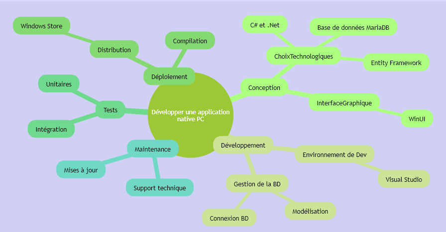

# 420-413-H24

# La page du cours
Le cours développement d’applications pour entreprises

***
Mon horaire et mes disponibilités  : [Lien vers mon horaire et mes disponibilités](blob/documents/Dispo.pdf)

***

## Plan du cours

Le plan du cours qui [ici](blob/documents/420-413-MV%20Développement%20d'applications%20pour%20entreprises.pdf) peut changer durant la session.

## Planification des remises

### Évaluations de l'apprentissage

#### Examens et Quiz (en classe)
|Type d’évaluation|Pondération|Date de l'examen| Durée de l'examen| 
|:---:|:---:|:---:|:---:|
|Quiz #1 | 3 %| 14 février 2024 | 30 minutes |
|Quiz #2 | 3 %| 28 février 2024  |  30 minutes |
|Quiz #3 | 3 %| 27 mars 2024 | 30 minutes  |
|Quiz #4 | 3 %| 17 avril 2024 | 30 minutes  |

#### Devoirs (aide et réflexion pour le projet)
|Type d’évaluation|réalisation|Pondération|Sujet|Date de votre remise du travail|
|:---:|:---:|:---:|:---:|:---:|
|Devoir 1| en équipe | 5 %| [énoncé à venir]() | 31 janvier 2024|
|Devoir 2| en équipe | 5 %| [énoncé à venir]()| 21 février 2024|
|Devoir 3| en équipe | 5 %| [énoncé à venir]() | 06 mars 2024|
|Devoir 4| en équipe | 5 %| [énoncé à venir]() | 20 mars 2024|
|Devoir 5| en équipe | 5 %| [énoncé à venir]() | 03 avril 2024|

### Évaluations pour la gestion du projet

#### Suivi de l'avancement du projet
|Type d’évaluation|Pondération|Date de remise de l'échéancier|
|:---:|:---:|:---:|
|Semainier 1| 1 %| 18 février 2024 |
|Semainier 2| 1 %| 25 février 2024 |
|Semainier 3| 1 %| 03 mars 2024 |
|Semainier 4| 1 %| 10 mars 2024 |
|Semainier 5| 1 %| 24 mars 2024 |
|Semainier 6| 1 %| 31 mars 2024 |
|Semainier 7| 1 %| 07 avril 2024 |
|Semainier 8| 1 %| 14 avril 2024 |
|Semainier 9| 1 %| 21 avril 2024 |
|Semainier 10| 1 %| 28 avril 2024 |

#### Livraisons liées au projet de session
|Type d’évaluation|réalisation|Pondération|Date de remise de l'échéancier|
|:---:|:---:|:---:|:---:|
|La charte d'équipe| en équipe | 2 %| 04 février 2024 |
|Démo fin d'itération| en équipe | 2 %| 18 mars 2024 |
|Démo de fin de projet (application finale)| en équipe | 3 %| 22 et 24 avril  2024 |
|Présentation du projet| en équipe | 3 %| 22 et 24 avril 2024 |
|L'évaluation des pairs| individuel | 2 %| 01 mai 2024 |
|L'auto-évaluation| individuel | 1 %| 01 mai 2024 |
|Le projet de session (l'épreuve finale)| en équipe | 40 %| 05 mai 2024 |