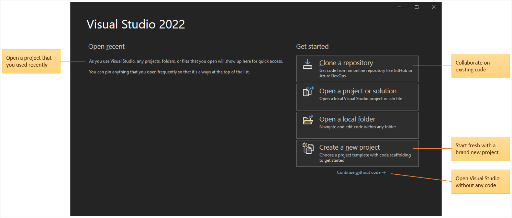

# Configuration de l’environnement de développement : Windows Visual Studio 2022

## Qu’est-ce que Visual Studio

- Visual Studio est l’interface de développement de Microsoft.
- Composé d’un ensemble d’outils permettant aux développeurs de créer des applications pour les plateformes .NET.
- Distribué en plusieurs éditions:
    - Community: Édition gratuite pour la formation des étudiants, les développeurs open source et les développeurs particuliers. Elle contient principalement des fonctionnalités de base pour la création de projets
    - Professional: Édition à destination des développeurs professionnels seuls ou sein de petites équipes.
    - Enterprise: Édition à destination des équipes professionnelles travaillant sur des projets nécessitant plus d’interactions entre leurs membres. De plus cette édition contient plus de fonctionnalités que les deux autres.

## Fonctionnalité disponibles


source : [https://learn.microsoft.com/fr-fr/visualstudio/get-started](configuration%20de%20l%E2%80%99environnement%20de%20de%CC%81veloppement%2054fdb7520c3141699e3694f869755090/Untitled.png)


### 1. **Développement du code :**

- Il offre un environnement IDE facilitant l’écriture et la gestion de code.
- Il permet de codez  rapidement à l’aide d’outils de [développement assistés par l’IA](https://learn.microsoft.com/fr-fr/visualstudio/ide/ai-assisted-development-visual-studio?view=vs-2022) comme [GitHub Copilot](https://learn.microsoft.com/fr-fr/visualstudio/ide/visual-studio-github-copilot-extension?view=vs-2022) et [IntelliCode](https://learn.microsoft.com/fr-fr/visualstudio/ide/intellicode-visual-studio?view=vs-2022).
- **L’Explorateur de solutions** qui permet d’organisez et naviguez dans votre code.
- etc.

### 2. **Générer des applications**

- [Créer des configurations de build pour votre projet](https://learn.microsoft.com/fr-fr/visualstudio/ide/understanding-build-configurations?view=vs-2022)
- Permet de [générer une application](https://learn.microsoft.com/fr-fr/visualstudio/ide/walkthrough-building-an-application?view=vs-2022), créer des builds instantanément et les tester dans un débogueur tout en offrant la possibilité de créer une configuration.

### 3. ****Déboguer le code****

- Visual Studio possède un débogueur intégré qui permet de profiler et de diagnostiquer la solution facilement.
- Il permet aussi de [mesurer les performances des applications](https://learn.microsoft.com/fr-fr/visualstudio/profiling/beginners-guide-to-performance-profiling?view=vs-2022).

### 4. ****Tester le code****

- Visual Studio possède des outils de test complets pour écrire du code de qualité
- Écrire les tests unitaires, avec Visual Studio, permet aux développeurs et aux testeurs de trouver rapidement des erreurs de logique dans le code.
- Il est possible d’analyser la quantité de code testée et afficher les résultats instantanément dans une suite de tests.
- etc.

### 5. ****Gestion de versions****

- Avec les fonctionnalités Git intégrées dans Visual Studio, vous pouvez cloner, créer ou ouvrir vos propres référentiels.
- La fenêtre Outil Git dispose de tout ce dont vous avez besoin pour valider et envoyer (push) les modifications au code, gérer les branches et résoudre les conflits de fusion.
- Avec un compte GitHub, vous pouvez gérer ces référentiels directement dans Visual Studio.

### 6. ****Collaborer avec d’autres personnes****

- Visual Studio Live Share permet le développement collaboratif en temps réel.
- Live Share vous permet de partager votre projet avec vos pairs, en utilisant le langage et la plateforme de votre choix.
- etc.

### 7. ****Déployer une application****

- Avec Visual Studio il est possible de distribuer une application, un service ou un composant avec différentes méthodes selon le type de déploiement dont on a besoin (pour l’installer sur d’autres ordinateurs, appareils, serveurs ou dans le cloud).
- Il est possible de partagez vos applications et votre code en les publiant sur le web ou sur Azure, ou en les déployant sur un partage réseau ou un dossier local.

### 8. ****Développement assisté par IA****

- Le [développement assisté par l’IA](https://learn.microsoft.com/fr-fr/visualstudio/ide/ai-assisted-development-visual-studio?view=vs-2022) dans Visual Studio permet d’utiliser des outils tel que : [GitHub Copilot](https://learn.microsoft.com/fr-fr/visualstudio/ide/visual-studio-github-copilot-extension?view=vs-2022), [GitHub Copilot Chat](https://learn.microsoft.com/fr-fr/visualstudio/ide/visual-studio-github-copilot-chat?view=vs-2022) et [IntelliCode](https://learn.microsoft.com/fr-fr/visualstudio/ide/intellicode-visual-studio?view=vs-2022).
- Cette fonctionnalité permet d’augmenter la productivité des développeurs.

> Attention: vous êtes en phase d’apprentissage donc l’utilisation de ces outils est interdite, jusqu’à l’indication, explicite, du contraire. L’enseignant va vous donner des instructions sur comment et quand vous pouvez les utiliser durant le cours.
> 

## Téléchargement de Visual Studio 2022

- Vous pouvez télécharger Visual Studio 2022 sur Windows et Mac gratuitement.
- Il y une alternative pour ceux qui ont Linux, en utilisant Visual studio Code (pas couvert dans le cours)
- Visiter la page web suivante pour télécharger Visual Studio : [https://visualstudio.microsoft.com/fr/](https://visualstudio.microsoft.com/fr/)

## [Exploration de Visual Studio](https://learn.microsoft.com/fr-fr/visualstudio/ide/quickstart-ide-orientation?view=vs-2022&source=recommendations#start-window-1)

### ****Fenêtre de démarrage****

Source du contenu : [learn.microsoft.com](https://learn.microsoft.com/fr-fr/visualstudio/ide/quickstart-ide-orientation?view=vs-2022&source=recommendations#start-window-1)



Source : [https://learn.microsoft.com/fr-fr/visualstudio/ide/quickstart-ide-orientation](https://learn.microsoft.com/fr-fr/visualstudio/ide/quickstart-ide-orientation?view=vs-2022&source=recommendations#start-window-1)

### **Créer votre premier projet**

Pour explorer les fonctionnalités de Visual Studio, nous allons créer un projet.

1. Démarrez Visual Studio et sélectionnez **Créer un projet**.
La fenêtre **Créer un projet** s’affiche et présente plusieurs *modèles* de projet. Un modèle contient les fichiers et les paramètres de base nécessaires pour un type de projet donné.
Ici, vous pouvez rechercher, filtrer et sélectionner un modèle de projet. La fenêtre **Créer un projet** affiche également la liste de vos modèles de projet récemment utilisés.
    
    
    
2. Dans la fenêtre **Créer un projet**, tapez **console** dans la zone de recherche pour filtrer la liste des types de projets. Affinez davantage les résultats de la recherche en sélectionnant **C#** (ou un autre langage de votre choix) dans la liste déroulante **Tous les langages**.
    
    
    
3. Sélectionnez le modèle **d’Application console**, puis **Suivant**. 
4. Dans la fenêtre **Configurer votre nouveau projet**, acceptez le nom et l’emplacement de projet par défaut, puis sélectionnez **Suivant**.
    
    
    
5. Dans la fenêtre **Informations supplémentaires**, vérifiez que **.NET 8.0** s’affiche dans le menu déroulant **Framework**, puis sélectionnez **Créer**.
    
    
    

### **Disposition de base**

- Examinez le contenu de votre projet à l’aide de l’**Explorateur de solutions**, qui affiche une représentation graphique de la hiérarchie des fichiers et des dossiers dans votre projet, solution ou dossier de code.
- Vous pouvez parcourir la hiérarchie et sélectionner un fichier pour l’ouvrir dans l’**Éditeur**. Le fichier *Program.cs* s’ouvre dans la fenêtre **Éditeur**. L’**Éditeur** affiche le contenu des fichiers. C’est l’emplacement dans lequel vous effectuez la majeure partie de votre travail de codage dans Visual Studio.
    
    
    
- La barre de menus en haut de la fenêtre de Visual Studio regroupe les commandes en catégories. Par exemple, le menu **Projet** contient les commandes liées au projet sur lequel vous travaillez. Dans le menu **Outils**, vous pouvez personnaliser le comportement de Visual Studio en sélectionnant **Options**, ou vous pouvez ajouter des fonctionnalités à votre installation en sélectionnant **Obtenir des outils et des fonctionnalités**.
    
    
    
- Obtenez une assistance IA avec [GitHub Copilot](https://learn.microsoft.com/fr-fr/visualstudio/ide/visual-studio-github-copilot-extension?view=vs-2022) directement dans l’éditeur avec des saisies semi-automatiques de code prenant en charge le contexte, des suggestions, des explications, etc. Par exemple, vous pouvez recevoir des suggestions de code en écrivant un commentaire en langage naturel pour décrire ce que le code doit faire.
    
    
    
    **[Obtenir GitHub Copilot](https://learn.microsoft.com/fr-fr/visualstudio/ide/visual-studio-github-copilot-extension?view=vs-2022#prerequisites)**
    
    En savoir plus sur le [développement assisté par l’IA dans Visual Studio](https://learn.microsoft.com/fr-fr/visualstudio/ide/ai-assisted-development-visual-studio?view=vs-2022).
    
- Obtenez de l’aide contextuelle en appuyant sur F1 lorsque le curseur de la souris se trouve sur un mot clé ou après avoir sélectionné un mot clé. Par exemple, sélectionnez *console* et appuyez sur F1 pour accéder à la documentation de la *classe Console*.
- Visual Studio offre une excellente accessibilité au clavier. Il prend en charge un tableau de raccourcis clavier intégrés pour effectuer des actions rapidement. Utilisez **Aide > Référence des raccourcis clavier** pour afficher la liste des raccourcis clavier.
- La **Liste d’erreurs** affiche les erreurs, avertissements et messages sur l’état actuel de votre code. S’il existe des erreurs (par exemple, une accolade ou un point-virgule manquant) dans votre fichier, ou n’importe où dans votre projet, elles sont répertoriées ici. Ouvrons la fenêtre **Liste d’erreurs** en sélectionnant le menu **Afficher**, puis **Liste d’erreurs**.
    
    
    
- La zone **Recherche** (**Ctrl + Q**) en haut est un moyen rapide et simple de trouver à peu près n’importe quoi dans Visual Studio. Vous pouvez saisir du texte lié à ce que vous voulez effectuer et une liste d’options pertinente pour le texte s’affiche. Par exemple, pour ouvrir une fenêtre de **Terminal**, recherchez ce terme et ouvrez la fenêtre à partir des résultats de la recherche. Le terminal intégré est ouvert et prêt pour les commandes.
    
    
    
- Si vous rencontrez des problèmes pendant l’utilisation de Visual Studio, ou si vous avez des suggestions d’amélioration du produit, vous pouvez utiliser le bouton **Envoyer des commentaires** vers le coin supérieur droit de l’IDE.
    
    
    

### **Générer votre application**

Générons le projet pour afficher une sortie de génération. La fenêtre **Sortie** affiche les messages de sortie après la génération de votre projet et ceux retournés par votre fournisseur de contrôle de code source.

Dans le menu **Générer** , cliquez sur **Générer la solution**. La fenêtre **Sortie** obtient automatiquement le focus et affiche un message de génération réussie.


### **Exécuter l’application**

1. Sélectionnez le bouton **Démarrer le débogage** (flèche verte) dans la barre d’outils ou appuyez sur **F5** pour exécuter votre application.
Visual Studio génère l’application, et une fenêtre de console s’ouvre avec le message **Hello, World!**. Maintenant, votre application fonctionne !
2. Pour fermer la fenêtre de console, appuyez sur n’importe quelle touche.

### L’éditeur de texte

- L’éditeur de texte de Visual Studio est un puissant outil permettant de saisir le code de l’application.
- Voici quelques fonctionnalités de l’éditeur de texte
- Les mots-clés et les types sont colorés pour faciliter la lecture et la compréhension du code
- La qualité du document en cours de visualisation est annoncée grâce à l’icône en bas du document pour indiquer s’il contient des suggestions, des avertissements ou des erreurs.
- L’intellisense permet d’afficher les classes et leurs membres en rapport avec le code saisi ainsi que les paramètres et les surcharges possibles pour les méthodes
- L’intellicode vous permet d’assurer la précision et la cohérence de l’exécution du code qui peut remplir une ligne entière à la fois. L’IA détecte votre contexte de code, notamment les noms de variables, les fonctions et le type de code que vous écrivez, pour vous donner les meilleures suggestions. Encore mieux : IntelliCode s’exécute sur votre ordinateur, ce qui garantit que votre code privé reste privé.

### Quelques fonctions de recherche

| Accès à la fonction | Son rôle |
| --- | --- |
| Édition -> Atteindre -> Atteindre tout ou juste Ctrl + T | Permet de rechercher dans les fichiers des types, des méthodes et d’autres éléments |
| Édition -> Atteindre -> Atteindre la ligne ou Ctrl + G | Permet de naviguer directement vers un numéro de ligne |
| Édition -> Rechercher et remplacer -> Recherche Rapide ou Ctrl + F | Permet de faire une recherche rapide. |
| Édition -> Rechercher et remplacer -> Rechercher dans les fichiers ou Ctrl + Maj + F | Permet de rechercher du texte dans tous les fichiers de la solution. |

### Paramètres de configuration de Visual Studio

- Il existe plusieurs paramètres supplémentaires permettant d’effectuer la configuration de Visual Studio.
- Plusieurs paramètres de base sont déjà définis pour vous, mais vous pouvez les modifier pour adapter Visual Studio à votre goût.
- On peut changer de thème en allant sur Outils -> Thème.
- Pour accéder à ces paramètres, allez dans la barre de titre et cliquez sur Outils -> Options où vous allez voir plusieurs autres paramètres.

### Nettoyage du code

- L’option de nettoyage du code permet d’appliquer des règles de formatage de code
- Plusieurs règles de formatage ont déjà été configurées par défaut
- Vous pouvez modifier les règles de formatage de code en allant sur Analyser -> Nettoyage du code -> Configurer le nettoyage du code.
- Pour appliquer le nettoyage du code dans le fichier en cours, il faut cliquer sur Analyser -> Nettoyage du code. Vous choisissez le profil de nettoyage de code à appliquer.

### **Déboguer votre application**

### Le débogueur intégré

- Le débogueur intégré permet de tester et suivre le déroulement de l’application, de disposer des points d’arrêts et de suivre pas à pas l’exécution du code, de surveiller et de modifier manuellement les variables en cours d’exécution.
- Le mode débogage peut être lancé en allant sur Déboguer -> Démarrer le débogage ou juste F5
- Visual Studio dispose de nombreuses fonctionnalités de débogage intégrées. Définissez un point d’arrêt à n’importe quel point d’intérêt dans le code pour suspendre l’exécution du code ou pour déboguer pas à pas. Consultez la fenêtre **Locals**, **Autos** et **Watch** pour résoudre les problèmes du code en inspectant les valeurs à chaque étape.

### Étapes :

1. Ajoutons du code supplémentaire à l’application. Ajoutez le code C# suivant avant la ligne qui indique `Console.WriteLine("Hello World!");` :
    
    ```csharp
    Console.WriteLine("\nWhat is your name?");
    var name = Console.ReadLine();
    ```
    
2. Sélectionnez le bouton **Démarrer le débogage** (flèche verte) dans la barre d’outils de débogage de Visual Studio pour exécuter votre application.
    
    
    
3. Utilisez le **Rechargement à chaud** pour résoudre les problèmes ou apporter des modifications au code à la volée et voir les résultats sans redémarrer l’application.
    
    
    
4. Vous pouvez arrêter l’application à tout moment en sélectionnant le bouton **Arrêter** dans la barre d’outils.
    
    
    

## ****Projets et solutions****

### **Solutions et projets**

Dans Visual Studio, une solution n’est pas une « réponse ». Une solution est simplement un conteneur dans lequel Visual Studio organise un ou plusieurs projets associés. Quand vous ouvrez une solution, Visual Studio charge automatiquement tous les projets que contient la solution.

### Création d’une solution

- Avec Visual Studio, il est rare de commencer à partir d’une solution vide.
- Visual Studio propose des modèles de projets contenant des éléments par défaut, les références et les configurations pour le type voulu
- La sélection de types de projet se fait lors de sa création soit à partir de la page de démarrage ou en allant sur Ficher -> Nouveau -> Projet

### Exercice

[Présentation des projets et solutions - Visual Studio (Windows)](https://learn.microsoft.com/fr-fr/visualstudio/get-started/tutorial-projects-solutions?view=vs-2022)